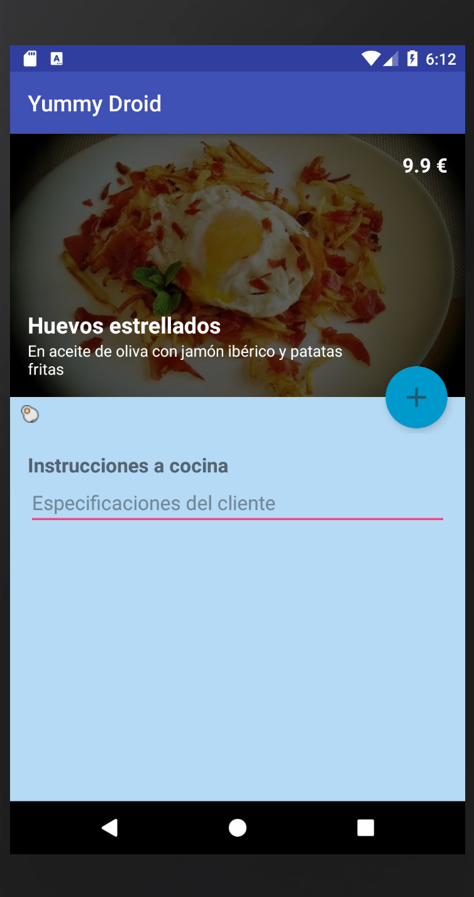
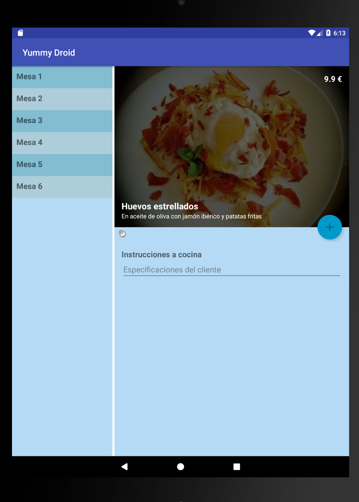

# YummyDroid

Aplicación Android para la gestión de mesas de un restaurante

Práctica del módulo **Fundamentos Android** del **VI BootCamp Development Mobile - KeepCoding**.

 

## Autor
**Cristian Blázquez Bustos**
